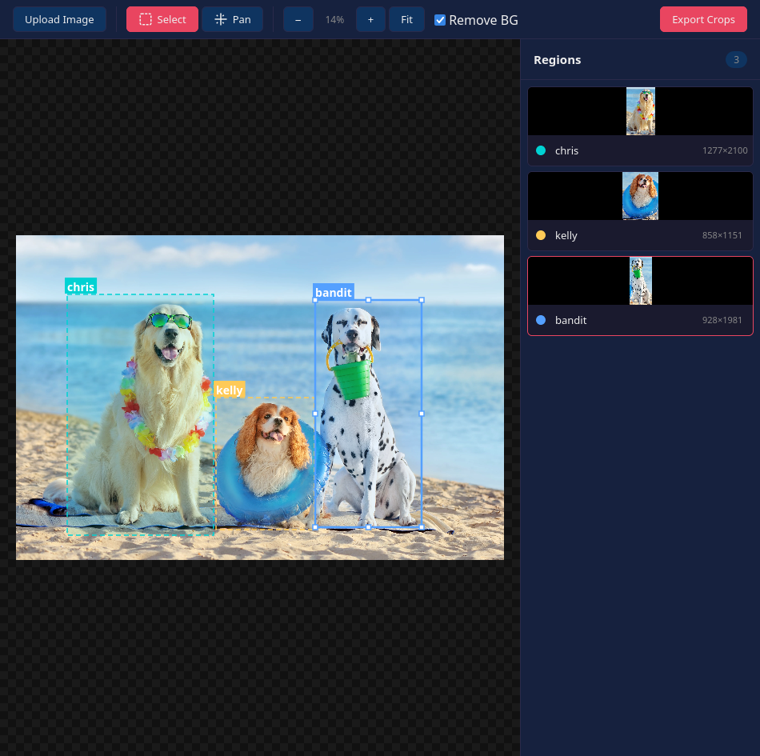

# Multi-Crop

A browser-based tool for cropping multiple regions from a single image. Load an image, draw named crop regions, and export them all at once as individual PNGs.



## Features

- **Multiple crop regions** — draw as many rectangular selections as you need on a single image
- **Named exports** — give each region a name; exported files use that name
- **Background removal** — automatically detects and removes the background color from exported crops using edge-pixel clustering and flood-fill
- **Pan & zoom** — scroll to zoom, middle-click or hold Space to pan, or use the toolbar controls
- **Drag & drop / paste** — load images by uploading, dragging onto the canvas, or pasting from the clipboard
- **Keyboard shortcuts** — `S` select, `F` fit to view, `+`/`-` zoom, `Delete` remove region, `Ctrl+S` export

## Usage

Serve the project directory with any static file server and open `index.html` in a browser. No build step or dependencies required.

```sh
# For example, using Python:
python3 -m http.server

# Or Node:
npx serve
```

1. Upload, drag & drop, or paste (Ctrl+V) an image
2. Draw rectangles to define crop regions
3. Name each region in the sidebar
4. Toggle **Remove BG** to strip detected backgrounds
5. Click **Export Crops** (or Ctrl+S) to download all regions as PNGs
